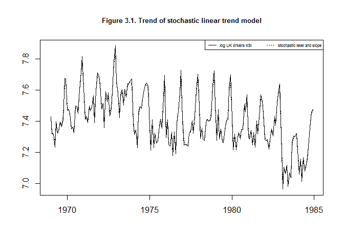
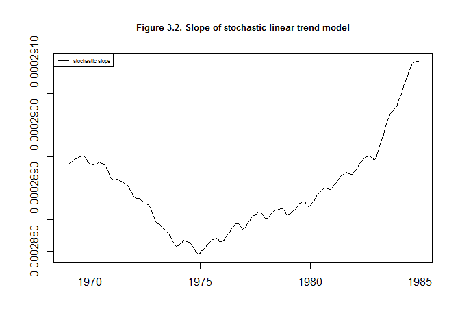
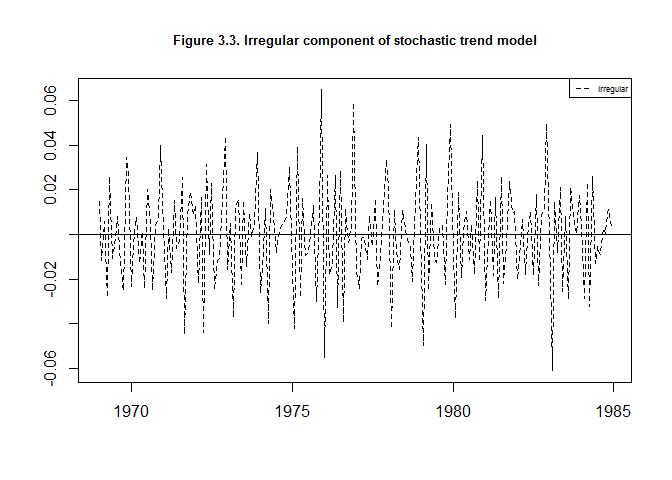

This repository provides code in R reproducing examples of the states space models presented in book ["An Introduction to State Space Time Series Analysis"](http://www.ssfpack.com/CKbook.html) by Jacques J.F. Commandeur and Siem Jan Koopman.


The code is provided in file "SSM.R"" and split into sections coresponding to the following parts of the book:

-   Introduction
-   Chapter 2 The Local Level Model
-   Chapter 3 The Local Linear Trend Model
-   Chapter 4 The Local Level Model with Seasonal
-   Chapter 5 The Local Level Model with Explanatory Variable
-   Chapter 6 The Local Level Model with Intervention Variable
-   Chapter 7 The UK Seat Belt and Inflation Models
-   Chapter 8 General Treatment of Univariate State Space Models
-   Chapter 9 Multivariate Time Series Analysis

In R Studio, each section of the code can be executed with keys CTRL+ALT+T, after placing a coursor in that section. Please make sure to execute the first section of the code including all the functions that are used by the other sections of the code.

Below, the code of the stochastic level and slope model of chapter 3 is shown as an example.

Loading data:

``` r
dataUKdriversKSI <- log(read.table("UKdriversKSI.txt")) %>% 
  ts(start = 1969, frequency = 12)
```

Defining model:

``` r
model <- SSModel(dataUKdriversKSI ~ SSMtrend(degree = 2, 
         Q = list(matrix(NA), matrix(NA))),  H = matrix(NA))
ownupdatefn <- function(pars, model){
  model$H[,,1] <- exp(pars[1])
  diag(model$Q[,,1]) <- exp(pars[2:3])
  model
}
(model)
#> Call:
#> SSModel(formula = dataUKdriversKSI ~ SSMtrend(degree = 2, Q = list(matrix(NA), 
#>     matrix(NA))), H = matrix(NA))
#> 
#> State space model object of class SSModel
#> 
#> Dimensions:
#> [1] Number of time points: 192
#> [1] Number of time series: 1
#> [1] Number of disturbances: 2
#> [1] Number of states: 2
#> Names of the states:
#> [1]  level  slope
#> Distributions of the time series:
#> [1]  gaussian
#> 
#> Object is a valid object of class SSModel.
```

Providing the number of diffuse initial values in the state:

``` r
d <- q <- 2 
```

Defining the number of estimated hyperparameters (i.e. disturbance variances):

``` r
w <- 3
```

Providing the autocorrelation lag l for r-statistic (ACF function):

``` r
l <- 12
```

Defining the first k autocorrelations to be used in Q-statistic:

``` r
k <- 15
```

Providing the number of observations:

``` r
n <- 192
```

Fitting model:

``` r
fit <- fitSSM(model, inits = log(c(0.001, 0001, 0001)), method = "BFGS")
outKFS <- KFS(fit$model, smoothing = c("state", "mean", "disturbance"))
```

Extracting the aaximum likelihood:

``` r
(maxLik <- logLik(fit$model)/n)
#> [1] 0.6247902
```

Calculating the Akaike information criterion (AIC):

``` r
(AIC <- (-2*logLik(fit$model)+2*(w+q))/n)
#> [1] -1.197497
```

Extracting the maximum likelihood estimate of the irregular variance:

``` r
(H <- fit$model$H)
#> , , 1
#> 
#>            [,1]
#> [1,] 0.00211807
```

Extracting the maximum likelihood estimate of the state disturbance variance:

``` r
(Q <- fit$model$Q)
#> , , 1
#> 
#>           [,1]         [,2]
#> [1,] 0.0121285 0.000000e+00
#> [2,] 0.0000000 2.774437e-09
```

Extracting the initial values of the smoothed estimates of states:

``` r
smoothEstStat <- coef(outKFS)
(initSmoothEstStat <- smoothEstStat[1,])
#>        level        slope 
#> 7.4157359290 0.0002893677
```

Extracting the values for the trend (stochastic level + slope):

``` r
trend <-signal(outKFS, states = "trend")$signal
head(trend, 24)
#>           Jan      Feb      Mar      Apr      May      Jun      Jul
#> 1969 7.415736 7.330297 7.312187 7.261499 7.371391 7.331428 7.353890
#> 1970 7.491953 7.473422 7.440664 7.363989 7.360783 7.350545 7.478187
#>           Aug      Sep      Oct      Nov      Dec
#> 1969 7.388317 7.376828 7.435665 7.639474 7.644703
#> 1970 7.490569 7.474472 7.601383 7.708188 7.775278
```

Showing Figure 3.1. Trend of stochastic linear trend model:

``` r
plot(dataUKdriversKSI , xlab = "", ylab = "", lty = 1)
lines(trend, lty = 3)
title(main = "Figure 3.1. Trend of stochastic linear trend model", cex.main = 0.8)
legend("topright",leg = c("log UK drivers KSI", "stochastic level and slope"), 
       cex = 0.5, lty = c(1, 3), horiz = T)
```



Showing Figure 3.2. Slope of stochastic linear trend model:

``` r
plot(smoothEstStat[, "slope"], xlab = "", ylab = "", lty = 1)
title(main = "Figure 3.2. Slope of stochastic linear trend model", 
      cex.main = 0.8)
legend("topleft",leg = "stochastic slope", 
       cex = 0.5, lty = 1, horiz = T)
```



Extracting the auxiliary irregular residuals (non-standardised):

``` r
irregResid <- residuals(outKFS, "pearson") 
```

Showing Figure 3.3. Irregular component of stochastic trend model:

``` r
plot(irregResid  , xlab = "", ylab = "", lty = 2)
abline(h = 0, lty = 1)
title(main = "Figure 3.3. Irregular component of stochastic trend model", cex.main = 0.8)
legend("topright",leg = "irregular",cex = 0.5, lty = 2, horiz = T)
```



Calculating the diagnostic for one-step-ahead prediction residuals (standardised):

``` r
predResid <- rstandard(outKFS) 
qStat <- qStatistic(predResid, k, w)
rStat <- rStatistic(predResid, d, l)
hStat <- hStatistic(predResid, d)
nStat <- nStatistic(predResid, d)
```

Showing Table 3.2 Diagnostic tests for the local linear trend model applied to the log of the UK drivers KSI:

``` r
title = "Table 3.2 Diagnostic tests for the local linear trend model applied to \nthe log of the UK drivers KSI"
dTable(qStat, rStat, hStat, nStat, title)
#> Table 3.2 Diagnostic tests for the local linear trend model applied to 
#> the log of the UK drivers KSI
#> -----------------------------------------------------------------------------
#>                     statistic    value   critical value   asumption satisfied
#> -----------------------------------------------------------------------------
#> independence           Q(15)   100.609            22.36        -
#>                         r(1)     0.005           +-0.15        +
#>                        r(12)     0.532           +-0.15        -
#> homoscedasticity       H(63)     1.058             1.65        +
#> normality                  N    14.946             5.99        -
#> -----------------------------------------------------------------------------
```
